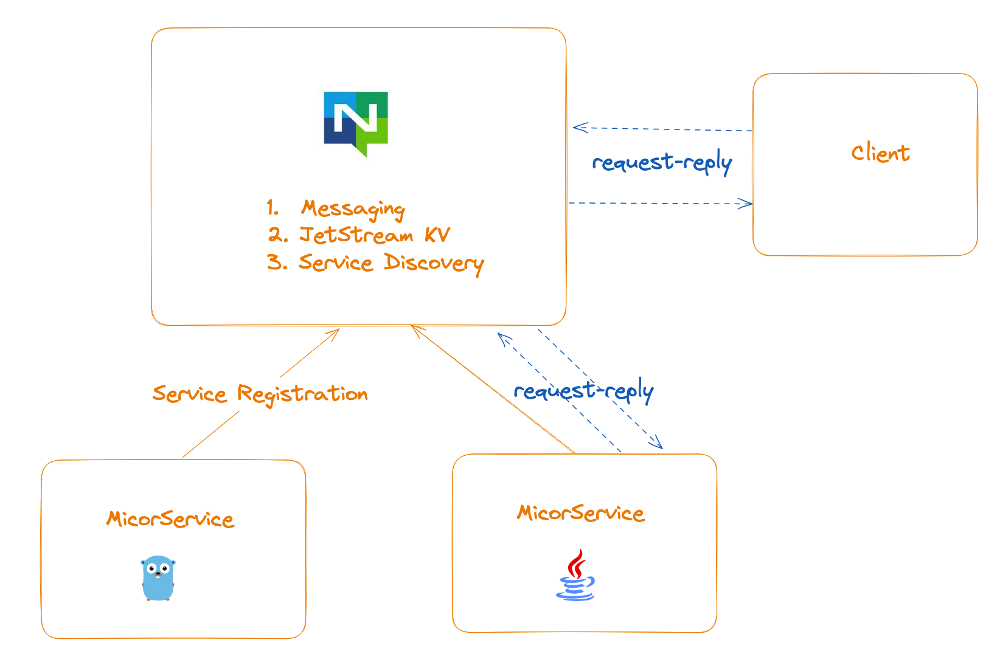
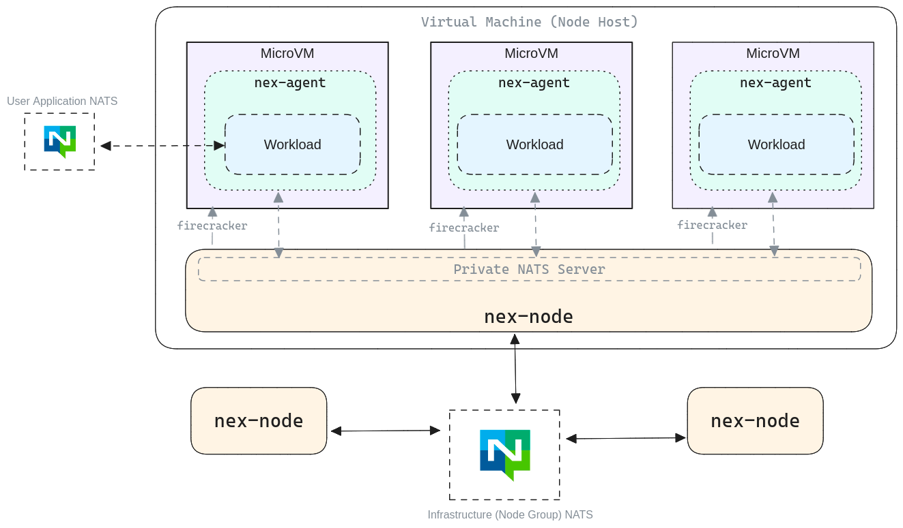

RSocket Broker可能并不孤单啦，伴随着NATS 2.10的发布，[NATS Services Framework](https://natsbyexample.com/examples/services/intro/go)被更多的人了解，
加上最新的[NATS Execution Engine](https://nats.io/blog/introducing_nex/)发布，这两者在架构设计上非常相像啦，这里我们就讨论一下。

# NATS Services Framework

让我们看一下NATS Services Framework的架构图：

从上图我们可以看出，NATS Server具备了服务的注册发现能力，而起本身还承担着流量转发的功能，这和RSocket Broker的架构完全一致。
但是RSocket在这方面还是更加强大一些，这里我们不一一对比，主要列出一些核心的差异：

* RSocket是通讯协议，通讯相关的元数据这些都是内置的，而NATS是基于消息的字节流，这些需要你自己定义
* 背压支持，RSocket支持背压，NATS不支持
* Broker的元数据能力：NATS的微服务目前主要就是名称、版本和描述，并未提供更多的元数据能力，而RSocket Broker提供了更多的元数据能力，比如：标签、环境、地区、负载均衡策略等

RSocket和NATS Services在其他方面还是非常相似的，尤其是通讯模型：

* Request-Response: NATS的Request-Reply
* Fire-and-Forget: NATS的事件Publish
* Request-Stream: NATS的Publish/Subscribe实现
* Channel: NATS的Publish/Subscribe可以实现

# NATS Execution Engine

NATS Execution Engine是一个基于NATS的Serverless平台，它的架构图如下：

其主要是针对FaaS和微服务部署场景，这个是RSocket Broker目前并没有的，我个人做过基于[Deno](https://deno.com/)的Serverless方案，
如果是部署JS/Wasm，这方面Deno和RSocket对接，完全也是可以的。

# 总结

NATS Services Framework和NATS Execution Engine都是非常不错的项目，如果你对NATS感兴趣，可以关注一下。
以下是个人的一些建议：

* Golang技术栈：如果你的技术栈为Golang，NATS也是Golang编写的，而且对接简单，个人是建议可以考虑NATS Services Framework和Nex
* Java技术栈：考虑RSocket Java SDK的稳定性，同时Spring 对RSocket的支持，个人是建议可以考虑RSocket方案。

如果你想了解更多关于NATS Services Framework和NATS Execution Engine的信息，可以参考：https://linux-china.davao.page/blog/2024-01-26-nats-nex/
